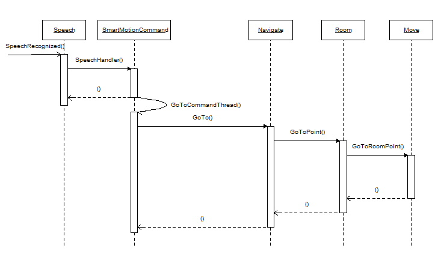

# Autonomous Robot Control
The main autonomous robot control software resides on the robots mini PC.  It is composed of the main executable, AutoRobotControl.exe, and nine DLLs that compose its skills and tools.  Skills are complex operations that expand the robots capabilities to do useful tasks and require no GUI.  Tools are complex operations that require a GUI and therefore only run from the remote administrative interface. Their primary use is as calibration tools and operation debuggers.

## AutoRobotControl 

### General Operation

Normal operation uses speech as the primary interface. Microsoft provided speech synthesis and recognition is used. After start up the normal interaction pattern is human command and  robot response:

1.A spoken command for a supported grammar is recognized and passed to the speech recognized event handler.
2. If a command handler is registered for the grammar then its SpeechHandler method is called with the command string.
3. The speech handler:
- Checks the robot's capabilities (i.e. what sub-systems are operational) to see if the command is supported.
- Registers a stop command handler with the Speech class if necessary.
- Starts the command execution thread.
4. The command execution thread:
- Executes the command.
- Uses "conversations" for user input as necessary.
- Checks for a "stop indication" during execution if supported.
- Unregisters the stop command handler if registered by the speech handler.
- The stop command handler sets the "stop indication" is invoked.

The Sequence diagram for a move to a point within the current room follows:

 

The supported commands are summarized below:

| Commands Implemented | Commands Supported | Command Handler Source File |
|----------------------|--------------------|-------------|
| basic | done, shutdown, exit, robot status, localize, last error,  | BasicCommands.cs |
|dumb motion |right turn, left turn, forward, backward, stop, recharge |DumbMotionCommands.cs |
| autonomous motion | go to point \| room \| room & point , face point, come here, come with me |SmartMotionCommands.cs|
| complex operations with GUI support (i.e. tools) |display ‘tool name’, close display | ToolsCommands.cs|
| complex operations without GUI support (i.e. skills) |run skill ‘skill name’, close skill | SkillsCommands.cs|

The grammar definitions can be found in the cal folder.

### Motion Model

The current implementation does not attempt to emulate human motion patterns (continuous, smooth motion).  It implements a “simplistic” motion pattern that makes path planning and localization as easy as possible.

1. Within a room
   - Determine path from the start location to the end location
   - For each point in the path the robot turns to face the next point and then moves to it.  Upon arriving at each point, the robot stops and determines its pose (including the location probabilistic density function).
2. Between rooms
   - Determine the room sequence (i.e. path)
   - For each room except final room
     - Move to exit point for next room
     - Move to connector
     - Move to the entrance point for the new room
   - Final room, move to the end location (see 1)

### Localization and Navigation

For the robot to move autonomously, it must be able to localize (i.e. determine its current location) and navigate (i.e. determine a path from where it is to where it wants to go).  The basic assumptions and constructs used in the current implementation are:

1. A building is:
   - a collection of connected rooms
   - connected rooms share a “connection” or “connector”
2. Room implementation assumes:
   - a rectangular structure with "walls" perpendicular to the major axis
   - a "GUI" coordinate system (0,0 @ upper left corner, X increase going right, Y increase going down)
   - 0 direction is perpendicular to and towards the "northward" wall etc.
3. The robot’s pose is composed of the unique room name, room coordinates and orientation
4. Room localization uses:
   - The minimum room context found to work:
     - 2D floor plan room map using 1 sq in grid with each grid being open or occupied
     - Each room has key context data maintained in a SQLite data base that is loaded into memory for access
     - Static room features (walls, corners and connection edges) and "targets" that are embedded in the room map
   - Location probability based on a motion model and localization type characteristics
   - Always know approximate orientation from magnetic compass in head assembly 
   - Feature search that reflects the location probability, room context and sensor distance/movement limitations
5. Navigation uses:
   - named locations (rooms and their connections and room points) kept in the building (i.e. the collection of room data bases) data base
   - reduced definition 2D map using 225 sq in (15 X 15) blocks within a room
   - a directed graph of the room connections within a building [EMK.Cartography](http://www.codeproject.com/Articles/4391/C-A-Star-is-born)
   - optimized AStar path search from Franco, Gustavo to determine travel paths, i.e. a sequence of coordinates, within a room [PathFinder.cs](http://www.codeproject.com/Articles/15307/A-algorithm-implementation-in-C)
   - calculation of an appropriate exit point coordinate based on the room map and connections in the room data
   - AStar graph search to determine the room path (i.e. a sequence of rooms within a building) EMK.Cartography

Establishing the robots pose is based on a probabilistic model of location (see Probabilistic Robotics for a complete discussion [^1]).  The model used is outlined below:

1. A tracking process model of:
   - Move sequence (turn and linear move)
   - Motion model update (dead reckoning and move model probability)
   - Localization
   - Localization correction
2. An odometer type motion model based on the robots movement characteristics:
   - Low drift since motion controller corrects using a gyro
   - Relatively accurate turns since the motion controller uses a gyro
   - Lower accuracy in linear movements
3. Corrected location is based on localization characteristics (rather then Bayesian inference using a sensor accuracy model)
   - Verified location - The location was determined using two features, two perpendicular walls or a wall and a feature.  In this case all the pose has been well determined.
   - Wall only - In this case the orientation and one of the coordinates has be well determined.  The other coordinate has the same probabilistic values as before the correction.
   - Single point - This is the detection of  a corner, connection edge or target.  The location accuracy is highly dependent on the accuracy of the orientation.  During tracking this would be fairly well determined.
   - Connection - A connection is a discontinuity since when we cross it we must go from one room map to another.  In addition the move process for going through a connection is more exact then the normal move and the connection itself limits where the robot can be.
   - User input (i.e. based on conversation with a human)

The location probability density function in each case is determined using a particle filter.  The current implementation uses 5000 points calculated with the Box - Muller method (values fall within 3 to 4 sigma).  This is reduced to an expected location and an probable location ellipse for use by move and localization functions. [MotionMeasureProb.cs]

Localization comes in two varieties, initial determination and tracking.  The first of these corresponds to a location state of “unknown”.  It occurs always on the initial start up of the robot and can occur at other times if the robot determines it is “lost” or is given manual movement commands.  The initial determination is given considerable attention in the academic literature but I consider it of less concern because of the assumed  “operates with humans in a cooperative manner”.  The process implemented is outlined below:

1.	Using the orientation estimate provided by the compass, the room map of the likely room and the KINECT find a corner and make a preliminary pose estimate.  This operation uses a searching process so the corner found is not necessarily reliable.
2.	Using the pose estimate find another feature using the KINCET without searching.  With the two features we can use trilateration to calculate a good pose estimate.  The use of two features could fail to distinguish rooms if multiple rooms have the same dimensions, layout and orientation, but otherwise provides good assurance the correct location has been established.
3.	If a second feature can not be found then a “tracking” localization is attempted using the preliminary pose estimate and a single point localization location probability.
4.	If neither 2 or 3 is satisfactorily completed, then the robot attempts to use a conversation with a human to establish its pose.

Dead reckoning (i.e. tracking) is the normal localization status.  Once an initial determination of location has been made, the robot is in this state.  In this state the current location is assumed to be approximately correct as defined by the current location probability ellipse.  The following process is used to determine what actions should be taken to verify location based on the room's map:

1. Context information is gathered from 160° left to 160° right of the robots current orientation using the expected location and the room map.
2. The context information is analyzed for each primary sensor (KINECT and LIDAR) to determine if  they can perform a localization action (determine orientation and Cartesian distance from a wall or find a feature) on a specific item.
3. The possible actions are analyzed to select the two "best" actions:
   - Distance from two walls that are perpendicular to each other.
   - Determine orientation from a wall and find a feature.
   - Find two features.

The two actions are attempted.  If both succeed then the appropriate method [NavCompute.cs] is used to calculate the location:

1.	Two perpendicular walls - two wall approximation
2.	Wall and feature - feature orientation approximation
3.	Two features -  trilateration

Otherwise, the failed action(s) are removed and steps 2 and 3 repeated.  If two actions are not successful but determining orientation from a wall has succeeded, then the current orientation and one of the coordinates (X or Y) can be set.  If a feature has been found  it is used in a "feature orientation approximation" using the current assumed orientation.  [Locate.cs, LocDecisionEngine.cs]

The use of features to determine location works well if you can assure that a detection is not a false positive.  This is accomplished using “signatures” .  The current implementation uses the following signatures:

1. Wall
   - The normalized standard error of the estimate is below a threshold
   - The resulting calculated orientation agrees with the magnetic compass
   - The Cartesian distance is within limits established by the probable location ellipse
2. Other features
   - The distance is within limits established by the probable location ellipse
   - The bearing is within limits established by the probable location ellipse

In addition, the location correction must be within the probable location probability ellipse or it is rejected.  It should be noted that LIDAR  input must be extensively conditioned to remove anomalies.

### Obstacle Avoidance and Adjustment

Obstacle avoidance during motion in this implementation is fairly simple:

1. Check prior to each linear move using a 2D LIDAR scan.
2. Continuous sonar check by motion controller during motion.

This is okay for low congestion scenarios but probably no more. In the case of an unexpected  obstacle it can detect if a person is the obstacle. If it is, then it attempts to interact with the person to continue its motion.  If is not a person, it has limited capability to analysis the obstacle and figure out a way around it.

### Object Detection
The current implementation of MART does not use a lot of objection detection models. Three of the models used in this application are [based on TensorFlows's ssd_mobilenet_v1](http://download.tensorflow.org/models/object_detection/ssd_mobilenet_v1_coco_2018_01_28.tar.gz).  The people model is just the coco trained model converted by the OpenVINO tool set.  The hand and hand-robot arm models are transfer learning trained versions of it also converted by the OpenVINO tool set.  The face model uses an [Intel provided face recognition model](https://github.com/openvinotoolkit/open_model_zoo/tree/releases/2021/4/models/intel/face-detection-adas-0001). This requires the installation of [OpenVINO 2021 4.1 LTS](https://www.intel.com/content/www/us/en/developer/tools/openvino-toolkit/overview.html) and [OpenCV](https://pypi.org/project/opencv-python/).

The [ARA project](https://github.com/terry-ess/ARA), however, is highly dependent on object detection and image segmentation. Any useful autonomous robot will require the capabilities of both MART and ARA. So it will need to support the efficient use of models from fairly small to much larger. Interestingly, the results of a [recent experiment](https://github.com/terry-ess/JetsonOrin) indicate that the optimal results by keep the smaller models on the main compute platform using OpenVINO and place the larger models on an AGX Orin.
### Relative Motion
Relative motion is used when an exterior reference is used to control the motion.  This is used by three classes in AutoRobotControl, ComeHere.cs, FollowMe.cs and RechargeDock.cs. In each case a software [PID controller](https://www.wescottdesign.com/articles/pid/pidWithoutAPhd.pdf) is used to control the motion.  The use in ComeHere and RechargeDock is fairly simple since the linear speed is held constant, only the angle to the person or target has to be considered.  In FollowMe both distance and angle to the person must be considered so the "blending" of two PID controllers is used.
### Come With Me

The "come with me" command uses two classes, ComeHere.cs and FollowMe.cs. Come here is a fairly complete proof of principal implementation that uses the DOA service and room mapping to perform motion planning.  Follow me is a partially completed proof of principal implementation that provides a mobile capability that I expect to be important.  The current implementation using a slow sampling cycle, average ~ 220 ms, is able to follow a person walking at a good indoor pace and keep decent track of its location and its targets.  Because of the this it knows where it is on a continual basis and can recover from losing sight of its target when the target enters another room and makes a quick turn.

More importantly it is also a start point for both more "fluid" motion and the ability to handle at least moderate congestion. Next possible steps include:

1. Drop person detection time to ~ 30 ms with a 10th generation i7 mini PC running OpenVino.

2. Significantly improve obstacle avoidance.

3. Combine the current implementation's motion and navigation with the continuous tracking and obstacle avoidance to achieve "fluid" motion with the ability to accommodate moderate congestion. 

The first of these is trivial since we just need to buy a new [main compute platform](https://www.amazon.com/Kingdel-Powerful-Computer-i7-10510U-4096x2304/dp/B087J8KYLQ/?_encoding=UTF8&pd_rd_w=qwfcJ&content-id=amzn1.sym.5fe95cd4-8512-42fa-bf21-63d83b898785&pf_rd_p=5fe95cd4-8512-42fa-bf21-63d83b898785&pf_rd_r=KTBJY9FSMV48XVNTB5AA&pd_rd_wg=yzxQA&pd_rd_r=aa00bcf4-06f4-4f1a-b19e-d6ccd7e85a89&ref_=pd_gw_ci_mcx_mr_hp_atf_m&th=1). The second is not as easy. To do better we need to be able to frequently check for obstacles during motion.  Performing the check has two primary components:
  1. Collect the data
  2. Check the data

The first of these in the current implementation is by 2D LIDAR scan.  While this is a great tool for localization it provides too limited a view for effective obstacle detection.  Other means include 3D LIDAR or depth camera. The 3D LIDAR like the 2D LIDAR is just too slow, even with solid state LIDAR, unless we continuously scan into a circular buffer from which we can copy a "frame".  But the frame will have possibly significant point time differences. A depth camera on the other hand implements continuous scanning with frame access with no pixel time difference out of the box. The performance during the second part is set by the resolution of the scan and the CPU.  Where object detection, especially of smaller items, requires high resolution, obstacle detection in general does not. Test results from a number of depth camera at different low resolutions is summarized below (the i7-555OU is the CPU in the robot's mini-PC):

|CPU|Camera/Resolution/HFOV-VFOV|Check Time (ms)|
|---|-----------------|---------------|
|i7-5550U|Intel D415/480 X 270/48 - 40|77|
|i7-10700|Intel D415/480 X 270/48 - 40|46|
|i7-10700|KINECT/80 x 60/59 - 46|3|
|i7-10700|KINECT/320 x 240/59 - 46|25|
|i7-10700|KINECT/640 x 480/59 - 46|76|
|i7-10700|TERRABEE 3D cam[^2]/80 x 60/74 - 57|3|

It should be noted that in all cases the time to collect the data was under 1 ms. I think the "sweet spot" is found in the KINECT @ 320 X 240 on a i7-10700 or better CPU. It has more then sufficient resolution, good check time and a reasonable FOV for this use ([you can still buy them](https://smile.amazon.com/gp/product/B006UIS53K?ref=em_1p_0_ti&ref_=pe_2313400_655953250)). Combined with the drop in person detection and tracking calculation time due to the improved CPU, we would be able to perform a normal "follow me" processing cycle in well under 100 msec.  Possibly more importantly, this provides the basis for fluid motion with the ability to accommodate moderate congestion.  For moves within a room this would look like:

  1. Move planning as per current implementation
  2. Actual move starts the same way as the current implementation, it turns to the first intermediate point, but from there it is significantly different:
     - Move works like "follow me" but now the target is the moves final destination.
     - The move does the same processing cycle as "follow me" but without the person detection or linear speed adjustment.
     - When the robot arrives at the destination it does a localization.

## Skills

A skill is a dynamically loadable capability that builds on the core AutoRobotControl and possibly other skills to perform a useful task.  Skills can be loaded on the robot as needed prior to start up or reside permanently depending on the memory requirements and the uses of the robot.  Two basic "proof of principal" skills have been developed.

The room survey skill provides the capability for the robot to explore and record a new room.  The resulting recorded information is sufficient to build the new room's map and data base (i.e. it can learn a new room). Details are provided in the [project](./Skills/RoomSurvey/readme.md)

The work assist skill is a limited exploration of close robot - human cooperation.  Details are provided in the [project](./Skills/WorkAssist/readme.md).

## Tools

Most of the tools are fairly straight forward and require nothing other then the visual user interface and auto robot control matching classes.  The sensor alignment differs from the other tools in that it requires a "jig".  The jigs purpose it to provide accurate targets for sighting the alignment of the KINECT  and the front and read LIDARs.

 
 

## Support Files
The "Cal" directory includes all the static grammar and parameter files used in the application.  The grammar files have an "xml" extension.  All the other files are parameter files.

[^1]: Thrun, Sebastian, Burgard, Wolfgram and Fox, Dieter. 2006. Probabilistic Robotics
[^2]: Aliasing problems with this camera probably make it unusable in this context.