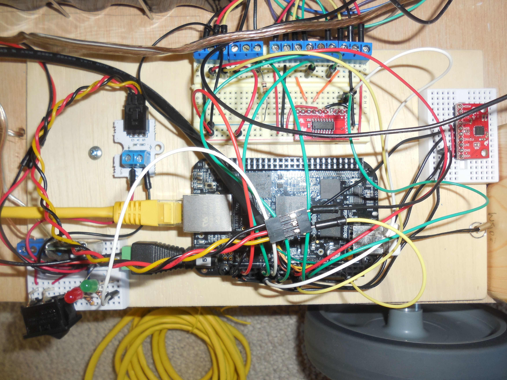
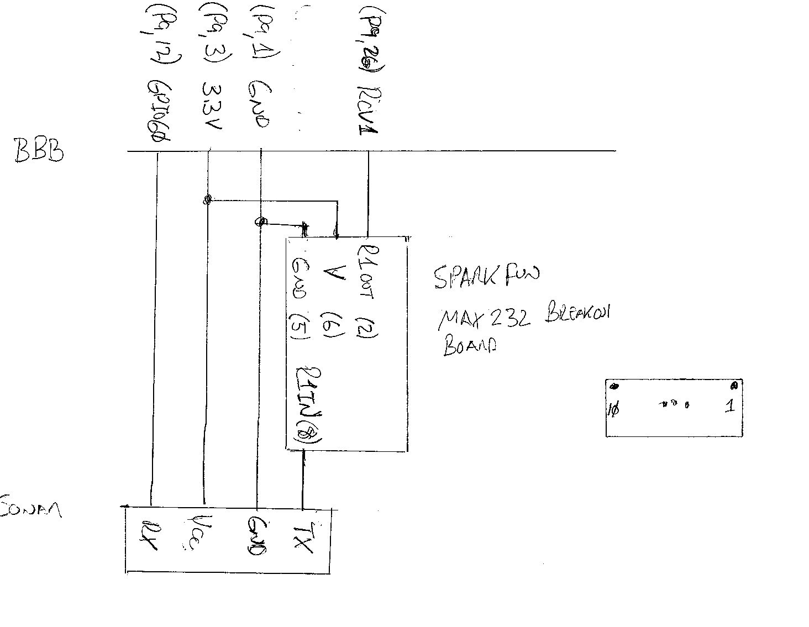

# Motion Controller

The motion controller provides the low level control of robot motion.  It is comprised of a BeagleBone Black and its supporting electronics. The motion controller software on the BBB is started by the AutoRobotControl using a SSH connection.  The motion controller software then operates as a simple UDP/IP "server". 

## Physical Interfaces

The physical interface between the BBB and the other electronics is summarized below:

| BBB Pin | Device |BBB Interface |Source file |
|-----|-----|------------|
|15, 27 | front and rear sonar |digital output | EzSonar.cpp |
|26 |front sonar| UART 1 (rx only) | |
|11 |rear sonar| UART 4 (rx only) | |
|21, 22| Devantech motor controller | UART2 (tx & rx) | MotorController.cpp |
|19, 20 | MPU 6050 break out board | I2C2 | Mpu6050.cpp |
|14| run LED | digital output | Gpio.cpp|
|23 | front read switch | digital input| Gpio.cpp|
|39 | Octopus voltage divider brick | analog input | VoltSensor.cpp|

Most of the interfacing is straight forward connecting wires. The complete circuit between the BBB and the serial connection of the sonars requires the use of a MAX 232 break out board between the BBB receive and sonar transmit.

## Software

### Control Interface
The motion controller software operates as a dual port UDP/IP "server".  The primary port  waits on commands from the robot control software over the Ethernet connection.  Each command is executed in turn and a response given. The secondary port waits for immediate stop commands.  Each is executed in turn with no response.[MotionController.cpp]

The currently used command set is summarized below:

| Command | Port | Description |
|---------|------|-------|
| HELLO |primary| get identification, immediate response |
| TIME m d y h s |primary| set date and time, response upon completion |
| LOG | primary|start logging, response after log opened |
| VOLTS | primary|get main battery voltage, immediate response |
| MCSTAT | primary|get motion control board status, immediate response|
| F y | primary |start uncontrolled forward linear motion with y speed (normal or  slow with normal as default), response upon motion detection, start up timeout or obstacle detection |
| B y | primary |start uncontrolled linear backward motion with y speed (normal and slow with normal as default), response upon motion detection, start up timeout or obstacle detection |
| CS x y | primary |change motor speeds to x (right) and y (left), response upon completion |
| SM | primary |stop linear motion in progress, response upon completion |
| TF x y | primary |start timed controlled linear motion for x inches at y speed (normal, slow or docking with normal as default), response upon completion or obstacle detection |
| TB x y | primary |start time controlled backward linear motion for x inches at y speed (normal or slow with normal as default), response upon completion or obstacle detection |
| TD | primary |get last linear move distance (inches) |
| MCR x y | primary|start controlled right spin for x degrees at y speed (normal or slow with normal as default), response upon completion or obstacle detection |
| MCL x y | primary|start controlled right spin for x degrees at y speed (normal or slow with normal as default), response upon completion or obstacle detection |
|RM|primary|start reference move
|RMCS|primary|change motor settings
|SRM|primary|stop reference move
|RMRA|primary|get the current relative angle (i.e. the angle difference since the start of relative motion)
| SB | primary |determine sensor bias, response upon completion |
| SFC | primary |get front sonar reading, immediate response|
| SRC | primary|get rear sonar reading, immediate response |
| DOCKED | primary |get docking status, immediate response |
| LAST MOVE | primary |download last move's data set, immediate response |
| LAST TURN | primary |download last spin's data set, immediate response |
| EXIT | primary |exit the application, downloads the operation log file |
| SL | secondary |top linear motion, no response |
| SS | secondary |stop spin, no response |

### Motion Control

The motion controller supports five primary types of motion: "uncontrolled" linear motion, controlled linear motion, "uncontrolled" spins, controlled spins and reference motion, e.g follow a human.  In each case the Devantech motor controller is set to the following configuration:

1.	Mode 0;
2.	Regulator disabled.

Mode 0 sets the motor speeds to the range from 0 to 255 where 0 is full reverse, 128 is stop and 255 if full forward.  In the current implementation motor reverse results in forward robot motion.

Controlled spins use dead reckoning calculations based on  the Z axis gyro data sampled from the MPU 6050.  The gyro's angular velocity data less bias is used without modification, start and stop are determined using the motor encoders and when to stop is based on a calibrated stop offset angle.  The parameters required to execute the spin, motor max. speed, motor acceleration and stop offset, are provided in configuration files, one for each command speed, with default values in the software. [MCSpinMotion.cpp]

Uncontrolled linear motion is just that.  Other then automatically stopping if an obstacle is detected by sonar,  all the motion controller does is set the motors as instructed.  The parameters required to execute the motion, motor max speed and acceleration, are provided in configuration files, one for each command speed, with default values in the software. [LinearMotion.cpp]

Controlled linear motion is significantly more complicated.  The motion controller uses time based dead reckoning to control the distance moved and gyro sampled data and a PID controller to minimize drift (i.e. motion deviating from a straight line due to imperfect motor mounting etc.).  The use of a time based dead reckoning was found to perform significantly better then attempts at an accelerometer based dead reckoning (both the MPU6050 and BNO055 accelerometers had dynamically shifting bias).  The calculation model is:

distance = ((AT + DT) X (TS/2) ) + (RT X TS)
where
	AT = acceleration time (sec)
	DT = deceleration time (sec)
	RT = run (i.e. time at top speed) time (sec)
	TS = nominal top speed (in/sec)

The actual top speed reached is impacted by a number of variables, the primary of which is the input voltage.  The current implementation adjusts the actual top speed based on the current input voltage.  All the variables, except RT, are determined using a semi-automated set of calibration tools in the robot controller.  The parameters required to execute the linear motion, motor max. speed, motor acceleration, acceleration time, deceleration time, nominal top speed and drift PID gains, are provided in configuration files, one for each command speed, with default values in the software. [TLinearMotion.cpp]
