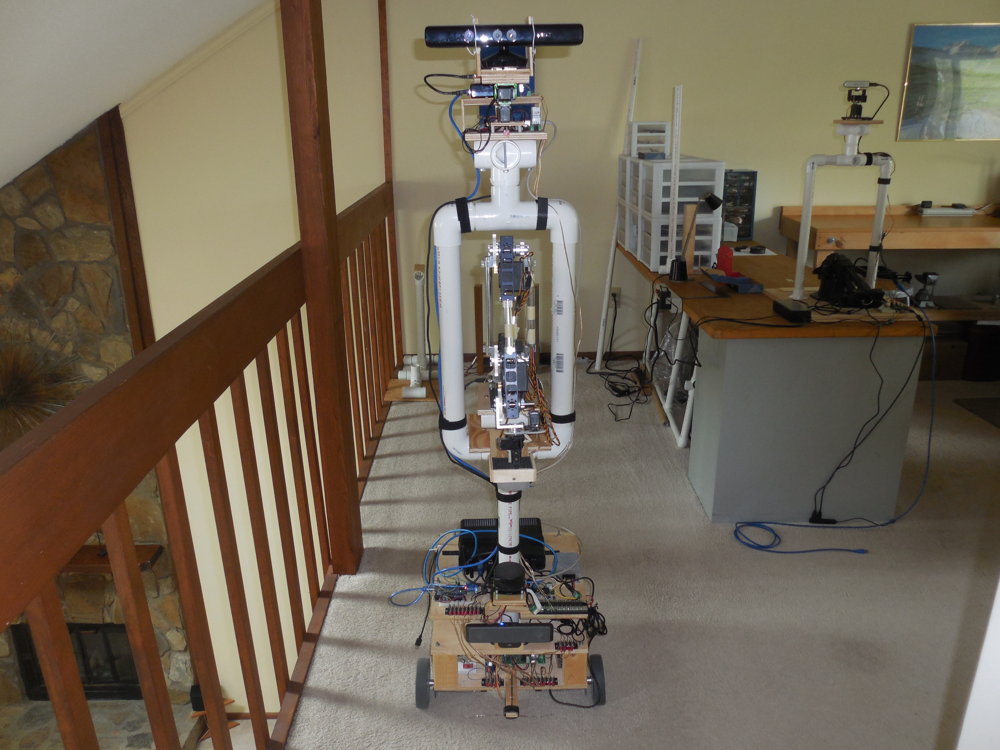

#  Mobile Autonomous Robot

This project is an experimental proof of principal prototype to see if a mobile robotic device using primarily "conventional" software can provide "smart" or even "intelligent" behavior in the real world with the aid of:

1. Domains of operation with significantly constrained context.
2. 3D perception hardware (depth camera, far field microphone array).
3. Limited "mature" deep learning technologies to include object detection using existing or transfer learning trained models, speech recognition with transactional natural language processing (i.e. a command and control chat bot) and speech syntheses.

This was very much an engineering exercise.  The interest was not in how to achieve general AI or in mimicking a human. The interest is in determining if the current "tool set" is adequate to make autonomous mobile robots.  Where autonomous in this case means the ability to complete tasks unaided in a dynamic environment that requires some "mental flexibility" but with a limited context domain. Please note that this project is not ongoing. It has an [MIT license](LICENSE.TXT) and is provided here for those interested in robotic engineering that would like to use it as a starting point for their own work.

The project has one very significant prejudice, it assumes that primary operational capabilities must be provided locally.  This means that the AI inferences (including NLP for command and control) are done on the robot. This is primarily driven by latency considerations and the belief that allowing a multi-thousand dollar robot to cease working because the WiFi is down is not a good engineering decision.

The robot's design evolved around five primary hardware components: a [Devantech RD03 robot drive system](https://www.robotshop.com/en/devantech-rd03-24v-robot-drive-system.html), a [custom NiMH Battery Pack (24V 13Ah)](https://www.batteryspace.com/custom-nimh-battery-pack-24v-13ah-312wh-4x5-f-rechareable-battery.aspx), a [KINECT for Windows sensor](https://www.amazon.com/Microsoft-L6M-00001-Kinect-for-Windows/dp/B006UIS53K/ref=sr_1_3?crid=20ORT8VIBVWVX&keywords=kinect+for+windows&qid=1649781879&sprefix=kinect+for+windows%2Caps%2C70&sr=8-3), a [RoboPeak RPLIDAR A1](https://www.robotshop.com/en/rplidar-a1m8-360-degree-laser-scanner-development-kit.html) and a [IDEARACE fan less Mini PC](https://useshop-co-kr.translate.goog/shop/item/5064886/?_x_tr_sch=http&_x_tr_sl=ko&_x_tr_tl=en&_x_tr_hl=en&_x_tr_pto=sc). See [electronics](electronics.md), [structural](structural.md) and  [recharging](recharge.md) for details.

  The software development is composed of twenty four projects within a single Visual Studio 2019 solution.  The software is primarily of C# code with some Python and C/C++ organized in seven assemblies:

1. The software that provides the high level control of the robot is in AutoRobotControl.  It includes ten projects, the AutoRobotControl project which implements all the core high level functionality and nine small skills or tools projects. The software resides on the robot's mini PC.  All the projects use C#
2. The software that provides a remote administrative interface to the robot is in RemoteUserInterface. It includes nine project, the RemoteUserInterface project which provides the core interfacing capabilities and eight small skills or tools projects.  All the projects use C#.
3. The BBBMotionController project provides low level motion control. It interfaces with the Devantech MD49 motor driver, the MPU6050 IMU breakout board and the front and back MaxBotix sonars.  The software resides on a BeagleBone Black SBC.  It is written in C++. This project uses a [VisualGDB Linux cross-compiler](https://visualgdb.com/) add on for Visual Studio 2019.
4. The DOAServer project is a small UDP/IP "server" that uses a Raspberry Pi 3 coupled with a ReSpeaker microphone array V2 to determine vocal direction of arrival. It is written in Python.
5. The OvServer project is a small "localhost" UDP/IP "server" that provides object detection inference using Intel's OpenVINO. It is written in Python.
6. The HeadAssemlbyController project is an Arduino MEGA 2560 based project that controls the KINECT's pan and tilt servos and provides access to the LSM303 compass breakout board and the TEMT6000 ambient light sensor.  The software is written in C. This project uses the [vMicro extension](https://www.visualmicro.com/) for Visual Studio 2019.
7. The SubSysRelay project is an Arduino UNO based project that controls the relays that control power for most of the hardware and for the recharge input circuit.  The software is written in C. This project uses the [vMicro extension](https://www.visualmicro.com/) for Visual Studio 2019.

More details are provided in the individual assemblies/projects:
- [Auto Robot Control](./AutoRobotControl/readme.md)
- [Remote User Interface](./RemoteUserInterface/readme.md)
- [BBB Motion Controller](./BBBMotionController/readme.md)
- [DOA Server](./DOAServer/readme.md)
- [Head Assembly Controller](./HeadAssemblyController/readme.md)
- [OpenVINO Server](./OVServer/readme.md)
- [Sub-system Relay Controller](./SubSysRelay/readme.md)
## Key Design Decisions

### Speech Issues

The primary user interface is verbal.  The robot must be able to talk with a generally understandable voice but it does not have to sound human (in my opinion it should not be mistaken for a  human). Microsoft's speech synthesis meets the requirement. For command and control this also requires the local ability to provide "chat bot" level speech recognition with intent classification and named entity recognition.  A key problem is how to do this.  Using high level speech recognition with a domain specific grammar (e.g. Microsoft speech recognition), using high level speech recognition coupled to a NLP program (e.g. coqui_ai STT and RASA) or a speech recognition - NLP engine created specifically to handle domain constrained speech using keyword detection (e.g. [Picovoice](https://picovoice.ai/docs/)).  Using a high level speech recognition front end has not worked well in my tests.  One of the key problems is caused by background noise and the robot's inability to determine if speech is directed at it even with a modern "beam forming" far field microphone array.  The use of keyword detection substantially improves the robot's understanding capability. But it lacks the capability for "free" speech when it is required such as short robot initiated transactional conversations and user initiated "intense" control cases (i.e. manual mode).  In addition the domain specific grammar of Microsoft speech recognition provides the ability to dynamically build grammars, a key feature with a mobile robot where location entities could change. This can not be provided with Picovoice or any trained NLP. Microsoft speech recognition does not work all that well with the ReSpeaker microphone array but it works much better with the KINECTs microphones which were tweaked specifically to work with it.

Voice direction of arrival, DOA, in this implementation is OK but not great.  The primary problem appears to be placement.  The ReSpeaker microphone array's DOA works best if the array is lower then the source of the voice. Regretfully that brings the array close to the noisy front LIDAR. In addition the use of voice activity to determine when to check direction would probably be problematic in any kind of noisy environment unless we use it only for a recognized keyword.

A mixed solution, DOA and keyword detection using Picovoice on the Raspberry PI with an attached ReSpeaker microphone array and "grammar detection" gated by the keyword detection using Microsoft speech recognition on the Mini PC using the KINECT microphone input, might provide the best outcome but it uses two no longer supported technologies, the KINECT and Microsoft speech (support stopped with .NET framework 4.8 and Core 3.1), so why bother.  Picovoice can be modified to support limited free speech (this is used in my [autonomous robotic arm experiment, ARA](https://github.com/terry-ess/ARA)) but I know of no work around for needing to retrain when the context changes.  However, the process of modifying the context and retraining is fairly easy  except when the Picovoice version has changed requiring the deployed software to use the updated version of Picovoice.

Given all that, this prototype uses Microsoft speech recognition.  Those more interested in a Picovoice based solution should take a look at [ARA](https://github.com/terry-ess/ARA).

### Real Time Issues
What is real time? Well it depends on what you are doing.  If we are interested in responsiveness to a user command, we need to show or speak a response within a second or so.  If we want to mimic human vision limits we need to have an input frame rate greater then 24 frames a second. But this prototype is NOT trying to mimic humans. So the responsiveness limit is important but the frame rate per se is not.

Two key input limitations exist due to the electronics and/or software:

1. Person detection takes ~ 85 ms
2. A front LIDAR scan takes ~ 800 ms (182 ms for the physical scan the remainder for anomaly removal)

The first does not impose a problem by it self.  At 5 samples/sec the "follow me" algorithm has no problem tracking and following a human.  Since the normal speed of the robot is limited to ~ 6.7 in/sec we could easily include human detection as part of a normal move. In situations with high congestion this in conjunction with "traffic planning" would be necessary. This prototype relies on the front and back sonar for obstacle identification during movement.  Only when the robot has to stop motion because of an obstacle does the robot use person detection to help decide an appropriate response.  This strategy works fine in low congestion scenarios.  

The second does impose a significant constraint.  A LIDAR scan is a key input for localization and obstacle avoidance.  As a result they typical take roughly a second.  So this prototype limits localization and obstacle avoidance (other than sonar) to when it is not in motion, i.e. at the completion of each segment of a motion path during normal motion.  This in turn limits the maximum length of any segment since localization is required on regular intervals, especially in long - thin corridors (i.e. hall ways).  See the motion model discussion in [Auto Robot Control](./AutoRobotControl/readme.md) for more details. The "follow me" algorithm is a first attempt to see what it would take to provide a finer degree of control.  Actual motion is controlled by a "fixed reference", i.e. the human the robot is supposed to follow.  Location tracking uses moderate rate (~ 5 Hz) estimation of distance traveled and direction change and on the fly full localization when passing through connectors (i.e. doorways). The current implementation is definitely only proof of principal but it does indicate what would need to be done (see detailed discussion in [Auto Robot Control](./AutoRobotControl/readme.md)).

The bottom line is that if you want fluid motion in moderate to high congestion, the robot would need substantially better electronics and much more extensive software. Some possible upgrades are provided in conclusions.

### Vision

The KINECT used in this prototype is no longer supported.  When introduced it was the first economical depth camera but that was ten years ago.  It only supports 640 X 480 frames, has a depth maximum distance of only 14 feet and gives you video and depth frames that are flipped (i.e. they are rotated 180 degrees and the Y axis is flipped).  So it is far from state of the art.  The [Intel D415 Depth Camera](https://www.intelrealsense.com/depth-camera-d415/) used in my other [autonomous robotics experiment](https://github.com/terry-ess/ARA) has much better specs.  However, initial testing showed that the KINECT has much less depth "drop out" then the D415 when used for room surveillance and that higher resolution was not a key factor in navigation and localization within a building.  In addition, RealSense development has been stopped by Intel and the long term availability is unknown. Finally, the microphones of the KINECT were specifically tweaked to provide the best performance of Microsoft speech recognition.  So this prototype uses the KINECT.

# Conclusions

The key conclusions of the experiment are summarized below:

1. The key mobile robot problems of movement, navigation and localization can be tackled with constrained context and a decent means of data organization (e.g. the 2D room map tied to the room data base in local memory).  There is one unstated assumption for this to be generally true.  Unoccupied areas in the map are only occupied temporarily by objects of sufficient size to be detected. With the current electronics this does not include a wide range of small objects (e.g. toys, small pets etc.).  In many residences this is not a good assumption.
2. If you want to handle high congestion motion or mimic human motion and adaptability, the robot would need substantially better electronics and much more extensive software (see Next Steps below).
3. The RoomSurvey skill demonstrates that the combination of a known room geometry, rectangular rooms, and SLAMish navigation can provide all the information necessary to create a new room's data base and 2D map.  This implementation uses an off-line program to combine all the gathered information into a usable map but it could be accomplished by the robot itself.
4. The robotic arm used in this project is not very accurate.  It did serve its purpose to explore the possibility of close robot - human cooperation in the "Work Assist" skill in AutoRobotControl.  The use of SLAM style local navigation and the key requirement that the person is at the work location (THIS IS KEY, the person is the absolute reference in terms of location of the work area otherwise you would need extensive room context knowledge) show that this type of task is achievable with only limited AI. If you are interested in a detailed look at the use of a autonomous robotic arm you should look at [ARA](https://github.com/terry-ess/ARA).
5. The primary emphasis of this project was on mobility. Deep learning AI was only lightly used in this project. As a result, no significant strengths or weaknesses were identified. For a much more extensive look at deep learning AI and autonomous robotic you should look at  [ARA](https://github.com/terry-ess/ARA).

# Next Steps

If I was to design the next generation prototype the main changes I would consider:
   - Combine MART and ARA to do a real task
   - Replace MART's arm with a [Interbotix WidowX-250 robotic arm](https://www.trossenrobotics.com/widowx-250-robot-arm.aspx) or better depending on the task.
   - Replace the mini PC with a significantly [higher performance version](https://www.amazon.com/Kingdel-Powerful-Computer-i7-10510U-4096x2304/dp/B087J8KYLQ/?_encoding=UTF8&pd_rd_w=qwfcJ&content-id=amzn1.sym.5fe95cd4-8512-42fa-bf21-63d83b898785&pf_rd_p=5fe95cd4-8512-42fa-bf21-63d83b898785&pf_rd_r=KTBJY9FSMV48XVNTB5AA&pd_rd_wg=yzxQA&pd_rd_r=aa00bcf4-06f4-4f1a-b19e-d6ccd7e85a89&ref_=pd_gw_ci_mcx_mr_hp_atf_m&th=1). See the "Come With Me" and "Object Detection" sections in [Auto Robot Control](./AutoRobotControl/readme.md) for details on why.
   - Add a [NVIDIA Orin development kit](https://www.nvidia.com/en-us/autonomous-machines/embedded-systems/jetson-orin/#:~:text=NVIDIA%20Jetson%20AGX%20Orin%20modules,other%20autonomous%20machine%20use%20cases.) to handle the more complex object detection models. Combined with OpenVino on the mini-PC, this will provide the ability to handle real work loads optimally. See the "Come With Me" and "Object Detection" sections in [Auto Robot Control](./AutoRobotControl/readme.md) for details on why.
   - Generalize the motion control, navigation and localization features of the "follow me" class to cover all motion.  This coupled with the more powerful computing hardware above should provide the basis for handling at least moderate congestion and higher efficiency motion. See the "Come With Me" section in [Auto Robot Control](./AutoRobotControl/readme.md) for details.
   - Try to find a depth vision option with long term support. This includes both the role performed by the KINECT and the upgraded object detection requirement outlined in the "Object Detection" section in [Auto Robot Control](./AutoRobotControl/readme.md).
   - Implement a speech approach using supported components. Based on current investigations, the likely components are:
     - [ReSpeaker microphone array v 2.0](https://www.amazon.com/gp/product/B07D29L3Q1/ref=ppx_yo_dt_b_asin_title_o04_s00?ie=UTF8&psc=1)
     - Keyword recognition using [Picovoice](https://picovoice.ai/docs/).
     - DOA based on keyword recognition.
     - NLP using Picovoice supported with an automated retrain and redeploy process.
     - Speech synthesis using [coqui-ai TTS](https://github.com/coqui-ai/TTS).
     - Place the speech sub-system on its own modest [compute platform](https://www.amazon.com/Beelink-Windows-Computers-Graphics-Desktop/dp/B09SLSS2LZ/ref=psdc_13896617011_t2_B09TKMYBBF?th=1).
   - Replace the BeagleBone Black with a Raspberry Pi with appropriate support electronics.  The BeagleBone Black has a hardware design fault that causes the Ethernet port to not activate on occasion. Preliminary test indicate that the RPi can handle the task and has no Ethernet connectivity issues.
   - Replace front and back LIDARs with supported, higher performance systems.  The preference would be two solid state LIDAR but to date, assuming you do not want to pay for automotive level systems, they appear and disappear quickly (the LS02C LIDAR used in the rear of the current prototype has disappeared) or have significant problems (the solid state CygLIDAR with 2 and 3D capability significantly distorts walls that are 90° to each other).
   - Replace the current 10/100 Mbps Ethernet switch with a 1000 Mbps switch.
   - Re-evaluate accelerometers to see if any currently available models do not have the dynamically shifting bias found in the MPU6050 and BNO055.  If so use this in the motion controller for accelerometer based dead reckoning.
   - Re-factor the KINECT software. A poor design decision was made early in the project on how to handle the KINECT's output.  Both video and depth images are flipped.  The decision was to use the native relative angle to objects in the images and to handle the negation (i.e. right is positive turn and left a negative) in the using software.  Since then other sensors have been added that use relative angles and are not flipped. If you are not careful it is easy to get it wrong. The KINECT software should make the negation and every place where it is currently done needs to be removed.

The projected retail bill of materials for the upgraded version is ~ $8K with a Interbotix WidowX-250 robotic arm.  If the selected task requires better it could easily exceed $10K.
 
