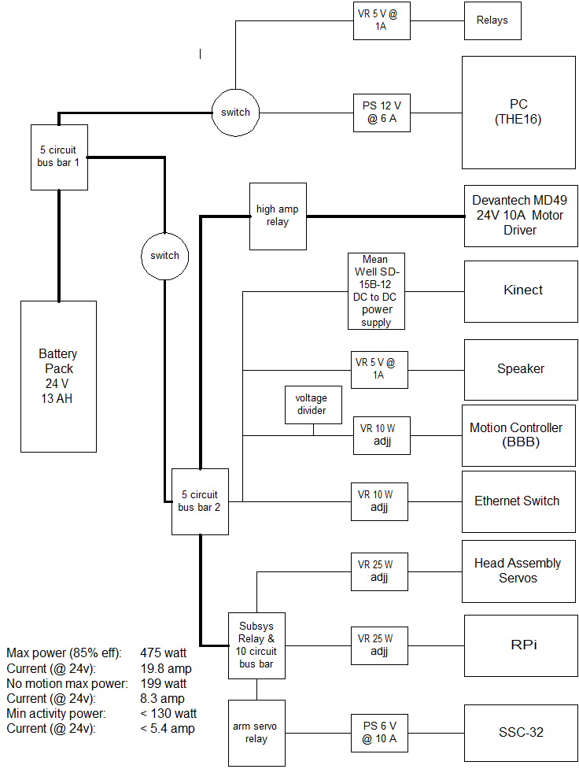
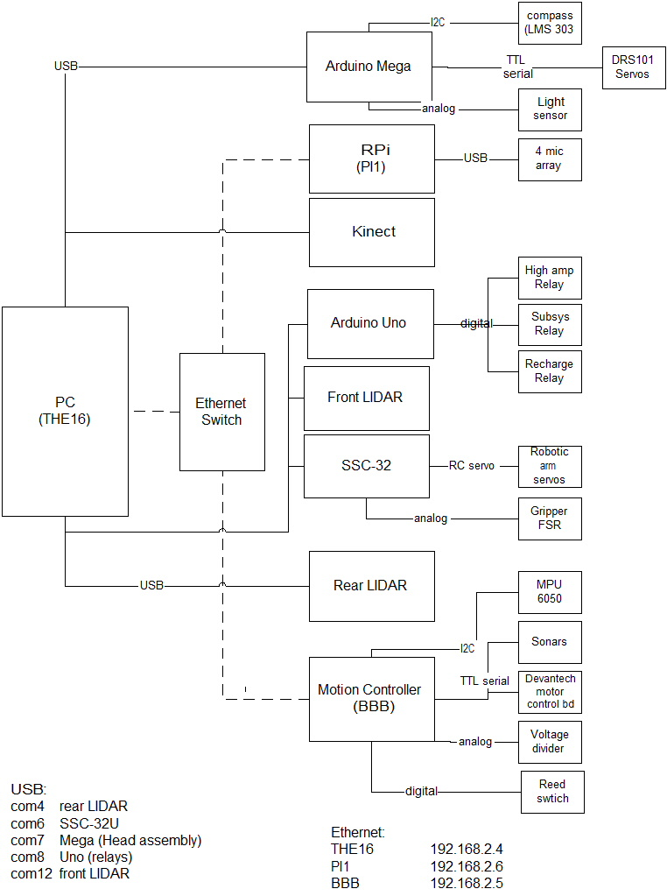

# Electronics

The robot's primary electronic hardware is composed of:

1. [Devantech RD03 robot drive system](https://www.robotshop.com/en/devantech-rd03-24v-robot-drive-system.html)
2. [Custom NiMH Battery Pack (24V 13Ah)](https://www.batteryspace.com/custom-nimh-battery-pack-24v-13ah-312wh-4x5-f-rechareable-battery.aspx)
3. [KINECT for Windows sensor](https://www.amazon.com/Microsoft-L6M-00001-Kinect-for-Windows/dp/B006UIS53K/ref=sr_1_3?crid=20ORT8VIBVWVX&keywords=kinect+for+windows&qid=1649781879&sprefix=kinect+for+windows%2Caps%2C70&sr=8-3)
4. [RoboPeak RPLIDAR A1](https://www.robotshop.com/en/rplidar-a1m8-360-degree-laser-scanner-development-kit.html)
5. [IDEARACE fan less Mini PC](https://useshop-co-kr.translate.goog/shop/item/5064886/?_x_tr_sch=http&_x_tr_sl=ko&_x_tr_tl=en&_x_tr_hl=en&_x_tr_pto=sc)
6. 8 port 10/100 Mbps Ethernet switch
7. [Arduino MEGA 2560 R3](https://www.robotshop.com/en/arduino-mega-2560-microcontroller-rev3.html)
8. [Arduino UNO R3](https://www.robotshop.com/en/adeept-uno-r3-microcontroller.html)
9. [BeagleBone Black Rev C](https://www.adafruit.com/product/1996?gclid=CjwKCAjw6dmSBhBkEiwA_W-EoEya3MhmVP7BVi6gzqTKIqTmhl1jpqJ4W0wgYR9TeeQeCoVXGFrc6BoCbAsQAvD_BwE)
10. [Raspberry Pi 3B](https://www.robotshop.com/en/raspberry-pi-3-b-computer-board.html)
11. [SSC-32U servo controller](http://www.lynxmotion.com/p-1032-ssc-32u-usb-servo-controller.aspx)
12. [LS02C LIDAR](https://www.aliexpress.com/item/4000154497321.html)
13. (2) [HerkuleX DRS 101 Servos](https://www.robotshop.com/en/herkulex-drs-0101-robot-servo.html)
14. [Pololu LSM303D compass and accelerometer board](https://www.pololu.com/product/2127)
15. [TEMT6000 ambient light sensor](https://www.robotshop.com/en/cytron-temt6000-ambient-light-sensor-module.html)
16. [ReSpeaker microphone array v 2.0](https://www.amazon.com/gp/product/B07D29L3Q1/ref=ppx_yo_dt_b_asin_title_o04_s00?ie=UTF8&psc=1)
17. (2) [MaxBotix LV-MaxSonar-EZ0](https://www.robotshop.com/en/maxbotix-ez0-ultrasonic-ranger.html)
18. [M100RAK V3 Robotic Arm Kit](https://www.robotshop.com/media/files/pdf2/m100rakv3-assemblymanual.pdf) (discontinued, replaced by [V4](https://www.robotshop.com/en/robotshop-m100rak-v4-modular-robotic-arm-kit-no-electronics.html))
19. [Lynxmotion Little Grip Kit](https://www.robotshop.com/en/lynxmotion-little-grip-kit-no-servos.html)
20. [Lynxmotion Wrist Rotate Upgrade (heavy duty)](https://www.robotshop.com/en/lynxmotion-heavy-duty-wrist-rotate-upgrade.html)
21. [Interlink Electronics model 402 FSR](https://buyinterlinkelectronics.com/collections/new-standard-force-sensors/products/fsr-model-402)
22. [MPU6050 IMU breakout board](https://www.sparkfun.com/products/11028)
23. [Grove 30A SPDT Relay](https://www.robotshop.com/en/grove-30a-spdt-relay.html)
24. [70W DC-DC Converter 12V 6A](https://www.robotshop.com/en/70w-dc-converter-12v-6a.html)
25. (2) [25W Adjustable Switching Voltage Regulator](https://www.robotshop.com/en/dimension-engineering-de-swadj3-switching-regulator.html)
26. (2) [5W Switching Voltage Regulator](https://www.robotshop.com/en/dimension-engineering-5v-1a-switching-voltage-regulator.html)
27. (6) [Volatge Regulator Breakout Board](https://www.robotshop.com/en/dimension-engineering-voltage-regulator-breakout-board.html)
28. (2) [10W Adjustable Switching Voltage Regulator](https://www.robotshop.com/en/dimension-engineering-10w-adjustable-switching-regulator.html)
29. [60W DC-DC Converter 6V 10A](https://www.amazon.com/uxcell-Converter-Regulator-Waterproof-Transformer/dp/B01CUA4KK8)

Power and communication block diagrams of the system follow:

## Power

## Comm

