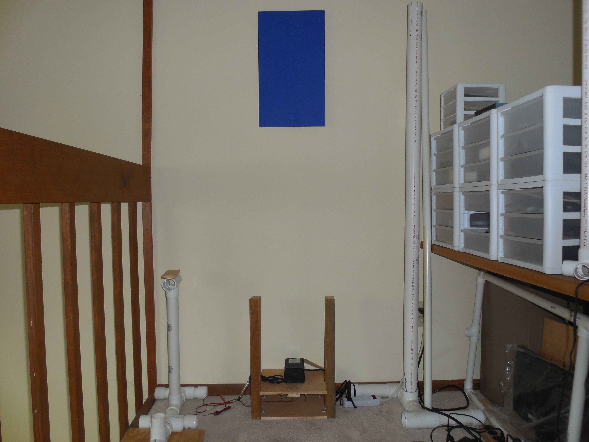

# Recharging
The battery in the current implementation has proven to be able to handle a good work load for an entire day.  But it does need to be recharged periodically even when not in use.  A primitive semi-automatic recharging scheme was implemented to provide this capability. The current implementation requires:

1.	The recharge station is against a wall.
2.	There is a target directly above the recharge station with the center at the same height as the KINCECT on the robot.
3.	There is straight path to the recharge station that is greater then 4 ft is length.
4.	The recharge station's data is in the room's data base.

## Station
Shown in the picture below is the recharge station and its "target".  The target is a blue (Clark + Kensington Premium Hi-Gloss Enamel Regal Blue) rectangle, 20.5 in. high and 12 in. wide. 
  

Basic construction is diagrammed below:

The contact points and magnets are shown in the below picture.  The contact points are just 2 in. long bolts.  There are nine [.25 in square permanent magnets](https://www.sparkfun.com/products/8643) placed between the contact points.

## Robot
The robot has a front probe at the proper height to dock with the recharge station. At the front of the probe there is a cat whiskers wire of sufficient length to reach the recharge points and on the under side a small reed switch. The input circuit is held open by a relay switch when the AutoRobotControl application is running.  It is only after the application is shutdown that the relay is closed and you can recharge.

The code for docking is in RechargeDock.cs. The basic concept for docking with the recharge station is conceptually simple:

1. Move to a "known" point in the room that provides a good start point for the docking.
2. Face the target above the recharge station and move towards the target to a point where LIDAR scans can see the recharge stations front posts clearly.
3. Use the position and angle of the front posts to move to just in front of the recharge station.
4. Move forward until the reed switch on the front probe picks up the magnets on the recharge station.

It should be noted that this is the only case where explicit knowledge of the local area is used to localize.
